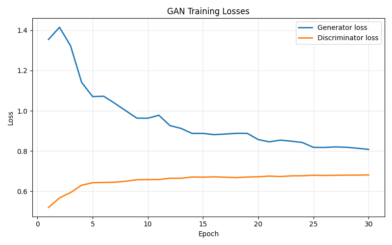
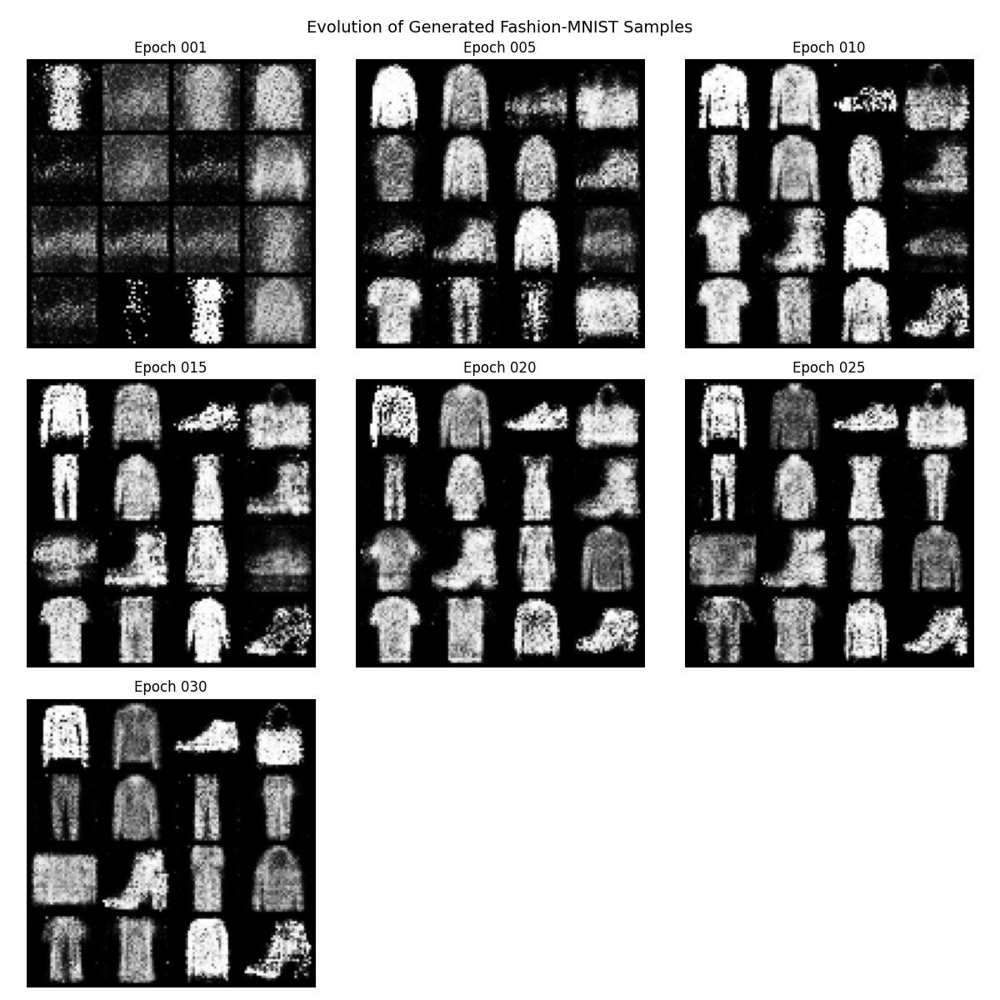
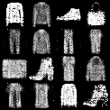
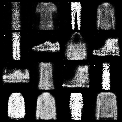
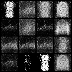

# Исследование обучения GAN на Fashion-MNIST
## Установка зависимостей

```bash
pip install -r requirements.txt
```

## Запуск обучения

```bash
python train_gan.py
```

Во время обучения скрипт:

- загружает Fashion-MNIST;
- обучает генератор и дискриминатор;
- выводит прогресс обучения в консоль;
- сохраняет изображения на выбранных эпохах;
- строит график лоссов;
- сохраняет итоговые веса;
- формирует таблицу истории обучения и итоговую сводку.

## Генерация изображений после обучения

```bash
python generate_samples.py
```

Пример с параметрами:

```bash
python generate_samples.py --checkpoint outputs/checkpoints/generator_final.pth --num-samples 16 --grid-cols 4 --seed 42 --output outputs/generated/my_samples.png
```

## Основные параметры

Основные настройки находятся в `config.py`.

- `batch_size = 128`
- `latent_dim = 100`
- `learning_rate = 0.0002`
- `epochs = 30`
- `sample_interval = 5`
- `log_interval = 50`
- `random_seed = 42`

### График потерь



### Прогресс генерации по эпохам



### Итоговая генерация после обучения

<p align="center">
  
  
</p>

### Сравнение ранней и поздней эпохи

<p align="center">
  
  
</p>

## Какие файлы сохраняются

- `outputs/samples/sample_epoch_001.png`, `sample_epoch_005.png` и другие изображения по эпохам;
- `outputs/checkpoints/generator_final.pth` — веса генератора;
- `outputs/checkpoints/discriminator_final.pth` — веса дискриминатора;
- `outputs/plots/loss_curve.png` — график потерь;
- `outputs/plots/training_progress.png` — единая картинка, показывающая прогресс генерации по эпохам;
- `outputs/generated/final_training_samples.png` — итоговая сетка после обучения;
- `outputs/generated/generated_samples.png` — новые изображения из отдельного скрипта;
- `outputs/training_history.csv` — история средних потерь по эпохам;
- `outputs/training_summary.json` — краткая сводка по запуску.

## Краткое описание архитектуры

Генератор получает случайный вектор размерности `100`, пропускает его через несколько полносвязных слоёв с `ReLU` и `BatchNorm` и выдаёт изображение `1x28x28` с активацией `Tanh`.

Дискриминатор получает изображение Fashion-MNIST, разворачивает его в вектор и классифицирует как реальное или сгенерированное при помощи полносвязных слоёв с `LeakyReLU` и выходом `Sigmoid`.

